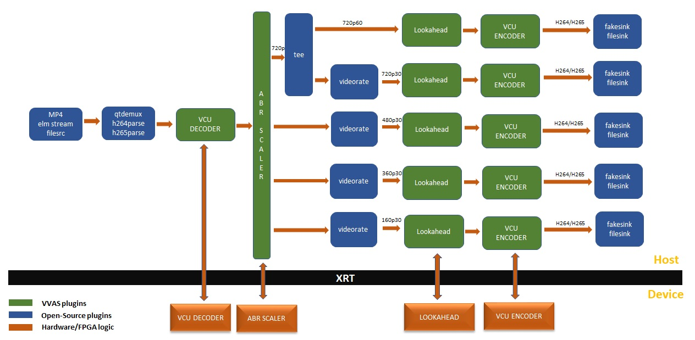
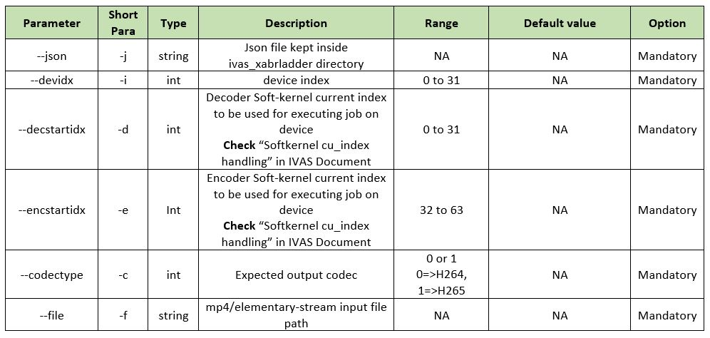

# VVAS ABR Ladder application
Vvas_xabrladder application is a command line utility which implements the gstreamer video transcoding pipeline. This Pipeline expects that one source of video input from file are fed into the video transcode pipeline. The encoder encodes one or more output streams from each scaled rendition of the input. The application auto detects the input codec type of input video stream. Supported codec type are H264/H265 when can be fed as elementary stream or MP4 container.     
Below is block diagram showing an ABR ladder transcode with five output streams. 


## Building the application
```
make
```

## Usage


## Example runs
1. Running one ABR ladder on one device
```
vvas_xabrladder --devidx 0 --decstartidx 0 --encstartidx 32 --codectype 1 --file <path to file>
```
2. Above pipe with short parameters
```
vvas_xabrladder -i 0 -d 0 -e 32 --codectype 1 -f <path to file>
```

3. Running one ABR ladder each on two devices
```
vvas_xabrladder --devidx 0 --decstartidx 0 --encstartidx 32 --codectype 1 --file <path to file>

vvas_xabrladder --devidx 1 --decstartidx 0 --encstartidx 32 --codectype 1 --file <path to file>
```

4. Running four ABR ladder on one device
```
vvas_xabrladder --devidx 0 --decstartidx 0 --encstartidx 32 --codectype 1 --file <path to file>

vvas_xabrladder --devidx 0 --decstartidx 1 --encstartidx 37 --codectype 1 --file <path to file>

vvas_xabrladder --devidx 0 --decstartidx 2 --encstartidx 42 --codectype 1 --file <path to file>

vvas_xabrladder --devidx 0 --decstartidx 3 --encstartidx 47 --codectype 1 --file <path to file>
```


